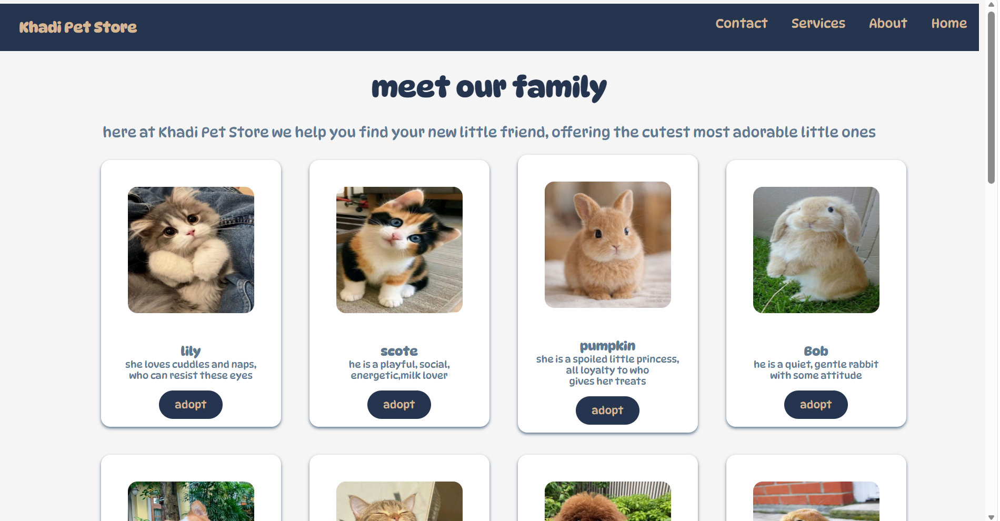
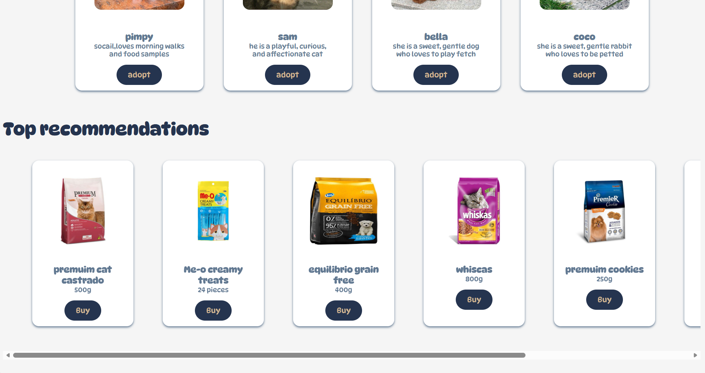
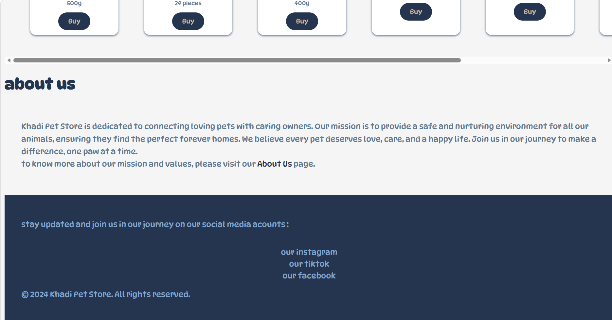
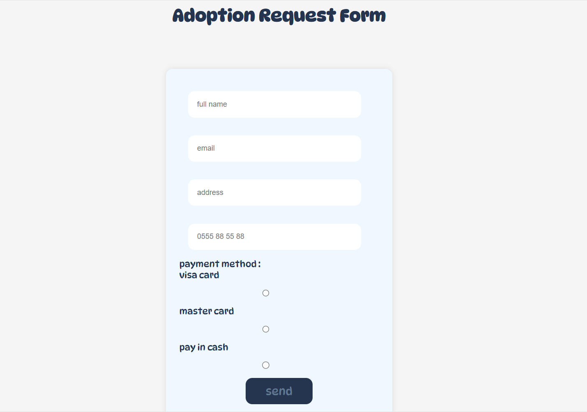

            #Pet Adoption Website

----DESCRIPTION:----
    this is a simple website that allows users to browse available pets for adoption and fill out adoption request form.

    this project was build using HTML and CSS and focuses on creating an interactive and userfriendly interface.

----FEATURES:----

    - view available pets for adoption.
    - fill out an adoption request form.
    - responsive design.

----USED TECH:----

- HTML.
- CSS.

----screenshots:----
Home page:

adoption form :

----What I Learned:----
- How to structure a web page using HTML.
- Styling using CSS.

----Future Improvements:-----
- Add a backend to store adoption requests
- Connect the form to a database
- Improve the design and user experience
- Add more dynamic features using JavaScript

#made by : Safia Touri;
